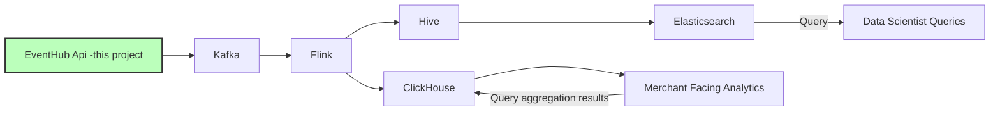

# EventHub
This is rustbootcamp capstone project using Rust within a **3-day** timeframe.
A high-throughput “front door” for event data - you send it events , and downstream systems can read and process those events in near real time.
Small Actix Web service that accepts JSON POSTs at /ingest and forwards them to Kafka.
Here is how EventHub will work in entire system:

The system’s entry point for streaming data that will later pass through Kafka, Apache Flink, Hive, Elasticsearch, and ClickHouse.
Functioning as the primary interface between event producers and the organization’s real-time data infrastructure, 
the EventHub API is designed to reliably collect, validate, and route large volumes of data events originating from  applications, sensors, or other microservices.

Testing Steps:
1. Start Kafka consumer consumer:
```bash
kafka-console-consumer.sh --bootstrap-server localhost:9092 --topic first_topics --from-beginning
```
or
```bash
kafkacat -b localhost:9092 -t first_topics -C
```
3. Build and run: `cargo run`.
4. POST using postman 


# Todo:
1. **Event Normalization**EventHub must ensure that the incoming events conform to a standard schema before they are forwarded to Kafka. This prevents downstream systems (Flink, Hive, etc.) from dealing with malformed or inconsistent data.
  
2. Add **Avro** and **Protobuf**-encoded events from multiple upstream systems.   

3. **Resilient Buffering and Flow Control**
   In high-traffic situations, EventHub must handle bursts gracefully. It may use internal queues or short-term caches (like Redis or an in-memory buffer) to handle spikes before handing events off to Kafka.
   This prevents message loss during network congestion or when Kafka brokers experience temporary load.

5. **Data Validation and Enrichment**
   The API can perform lightweight validations—checking required fields, timestamps, schema compliance, and perhaps basic enrichment such as adding metadata (source IDs, timestamps, or tenant info). Clean data ensures reliability for the downstream analytics pipeline.

6. **Metrics, Observability, and Monitoring**
   Given its central role, EventHub is instrumented for metrics collection—tracking ingestion rates, error counts, latency, and queue sizes. Integration with monitoring tools (Prometheus, Grafana, Datadog) allows operators to visualize flow health in real time.
-
